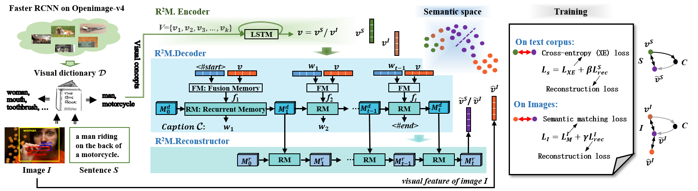

# Recurrent Relational Memory Network for Unsupervised Image Captioning



<p align="center">The overall framework of R2M.</p>


This is a Tensorflow implementation for [Recurrent Relational Memory Network for Unsupervised Image Captioning, IJCAI2020](https://arxiv.org/abs/2006.13611).


Requirements
----------------------
* Ubuntu 16.04
* CUDA 9.0
* cuDNN 7.0.5
* Java 8
* Sonnet 1.34
* Python 2.7.13
  * Tensorflow 1.12.0
  * Other python packages specified in environment.yaml


Prepare Data
----------------------
1. Download the MSCOCO/GCC descriptions from [here](http://cocodataset.org/)/[here](https://ai.google.com/research/ConceptualCaptions/download). Download the Shutterstock descriptions by running:
    ```
    python preprocessing/crawl_descriptions.py
    ```

2. Extract the descriptions. 
    ```
    python -c "import nltk; nltk.download('punkt')"
    python preprocessing/extract_descriptions.py
    ```
    
3. Preprocess the descriptions. 
    ```
    python preprocessing/process_descriptions.py --word_counts_output_file data/word_counts.txt --new_dict
    ```

4. Download the MSCOCO/Flickr30k images from [here](http://cocodataset.org/)/[here](http://shannon.cs.illinois.edu/DenotationGraph/data/index.html) and put 
all the images into data/[dataset]/images.

5. Object detection for the training images. You need to first download the
detection model from [here][detection_model] and then extract the model under
tf_models/research/object_detection.
    ```
    python preprocessing/detect_objects.py --image_path data/[dataset]/images --num_proc 2 --num_gpus 1
    ```
    
6. Generate tfrecord files for images.
    ```
    python preprocessing/process_images.py --image_path data/[dataset]/images
    ```

 *You can skip step 1-3 and download below files*
* MSCOCO-Shutterstock: https://drive.google.com/drive/folders/1ay0o0gUe2iaUQScIwoVjv8Nj3KdBp18f
* Flickr30k-MSCOCO: https://drive.google.com/drive/folders/1cIo1O1-_TypJdTAY1p1q3cMwzTPL_4W6
* MSCOCO-GCC: https://drive.google.com/drive/folders/1Ih4XHaQ1zJ85d4p_hciwzXXtiXARYL2g


Training
--------
You can change some settings by modifying `config.py`.

* Supervision Learning on Text Corpus
1. Train the model with only cross-entropy loss
```
python obj2sen_xe.py --job_dir checkpoints/step1
```
2. Fine-tune the model with cross-entropy loss and reconstruction loss
```
python obj2sen_xe+rec.py --job_dir checkpoints/step2 --obj2sen_ckpt checkpoints/step1/model.ckpt-XXX
```

* Unsupervised Visual Alignment on Images
3. Fine-tune the model with triplet ranking loss
```
python obj2sen_tri.py --job_dir checkpoints/step3 --obj2sen_ckpt checkpoints/step2/model.ckpt-XXX
```
4. Fine-tune the model with triplet ranking loss and reconstruction loss
```
python obj2sen_tri+rec.py --job_dir checkpoints/step4 --obj2sen_ckpt checkpoints/step3/model.ckpt-XXX
```

*Pretrained Models - R2M*
* MSCOCO-Shutterstock: https://drive.google.com/drive/folders/1Nqy0Gohhu33k8cgWwRNvISuSu01nWX5u
* Flickr30k-MSCOCO: https://drive.google.com/drive/folders/1JUH2_Aq7u9mwik9maHOKclnjOVqXo1Q9
* MSCOCO-GCC: https://drive.google.com/drive/folders/13BM7PYQMfYaQ6WXMvz9_u0NgotCktydR


Evaluation
----------

```
python test_obj2sen.py --job_dir checkpoints/step4/model.ckpt-XXX --vocab_file data/word_counts.txt
```

Citation
----------------
If you use this code in your research, please consider citing:

```text
@InProceedings{guo2020recurrent,
title = {Recurrent relational memory network for unsupervised image captioning},
author = {Guo, Dan and Wang, Yang and Song, Peipei and Wang, Meng},
booktitle = {International Joint Conference on Artificial Intelligence (IJCAI)},
year = {2020}
}
```


Acknowledgements
----------------

* This code began with [fengyang0317/unsupervised_captioning](https://github.com/fengyang0317/unsupervised_captioning). We thank the developers for doing most of the heavy-lifting.

[detection_model]: http://download.tensorflow.org/models/object_detection/faster_rcnn_inception_resnet_v2_atrous_oid_2018_01_28.tar.gz
